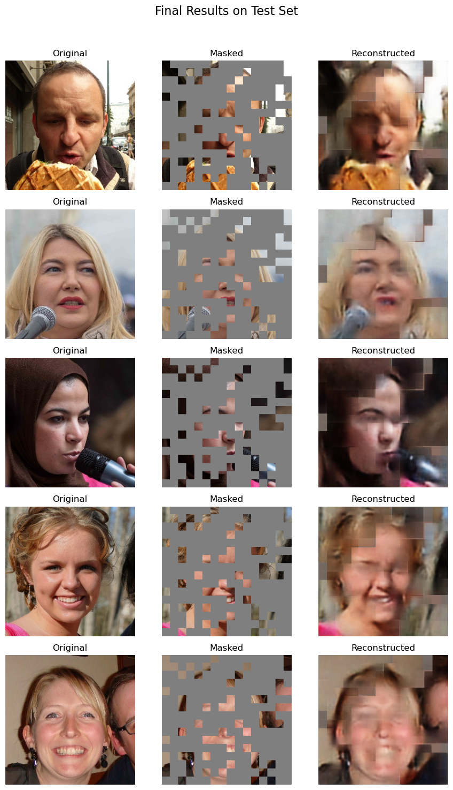

# Image Reconstruction with a Masked Autoencoder (MAE)

This project implements a Masked Autoencoder (MAE), a self-supervised learning model based on the Vision Transformer (ViT) architecture, to reconstruct human face images from partially masked inputs. The model is built using PyTorch.

## Project Overview

A Masked Autoencoder is a type of model trained to reconstruct an original image from a version that has had a significant portion of its patches randomly masked (or hidden). The core idea is that by learning to predict the missing information, the model develops a rich and meaningful understanding of the visual data.

This implementation uses a Vision Transformer (ViT) as its backbone. The encoder only processes the visible patches, making the training process highly efficient. A lightweight decoder then takes the encoded representation along with the masked tokens to reconstruct the full image.

## Dataset

The model was trained on a dataset of human face images. The images were preprocessed by resizing them to a resolution of 256x256 pixels and normalizing them. The dataset was then split into training, validation, and testing sets.

## Methodology

1.  **Data Preprocessing**: Images are loaded and transformed into tensors. A custom masking function is applied to randomly hide 75% of the image patches before they are fed into the model.
2.  **Model Architecture**: The architecture consists of:
    * **Patch Embedding**: The input image is divided into a sequence of flattened 16x16 patches.
    * **ViT Encoder**: A Transformer-based encoder processes the sequence of *visible* patches to learn a latent representation.
    * **Decoder**: A smaller Transformer-based decoder reconstructs the full image from the latent representation and special "masked" tokens.
3.  **Training**: The model is trained to minimize the Mean Squared Error (MSE) between the pixel values of the reconstructed image and the original image. The AdamW optimizer and a One-Cycle Learning Rate scheduler are used for efficient training.

## Technologies and Libraries Used

* **Python**
* **PyTorch**: For building and training the MAE model.
* **NumPy**: For numerical operations.
* **Matplotlib**: For visualizing the results.
* **Pillow (PIL)**: For image manipulation.
* **scikit-learn**: For splitting the dataset.
* **tqdm**: For displaying progress bars.

## How to Use

To run this project, you need to have Python and the necessary libraries installed.

1.  **Clone the repository:**
    ```bash
    git clone [https://github.com/your-username/your-repository-name.git](https://github.com/your-username/your-repository-name.git)
    ```
2.  **Install the dependencies:**
    ```bash
    pip install torch torchvision numpy matplotlib scikit-learn pillow tqdm torchinfo
    ```
3.  **Run the Jupyter Notebook:**
    Open and execute the `maskAE.ipynb` notebook within a Jupyter environment. Ensure your dataset path is correctly configured within the notebook.

## Results

The model was successfully trained to reconstruct images from a 75% mask. The output below shows a comparison of the original images, the masked input images given to the model, and the final reconstructed images generated by the model on unseen test data.

The results demonstrate the model's powerful ability to generate coherent and visually plausible completions for the heavily masked regions, indicating that it has learned meaningful features of human faces.



## License

This project is licensed under the MIT License. See the `LICENSE` file for more details.
